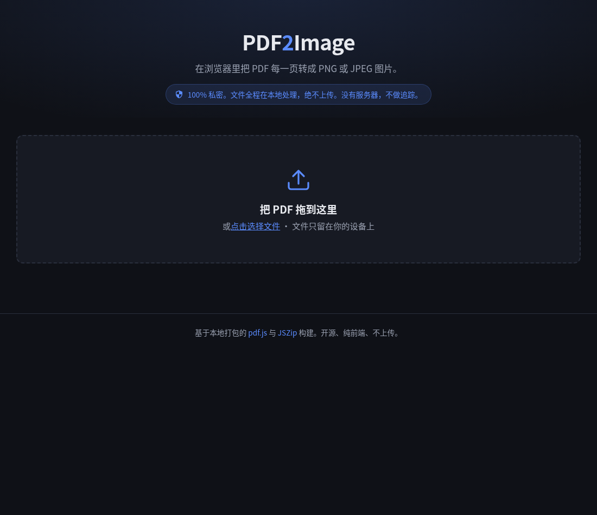
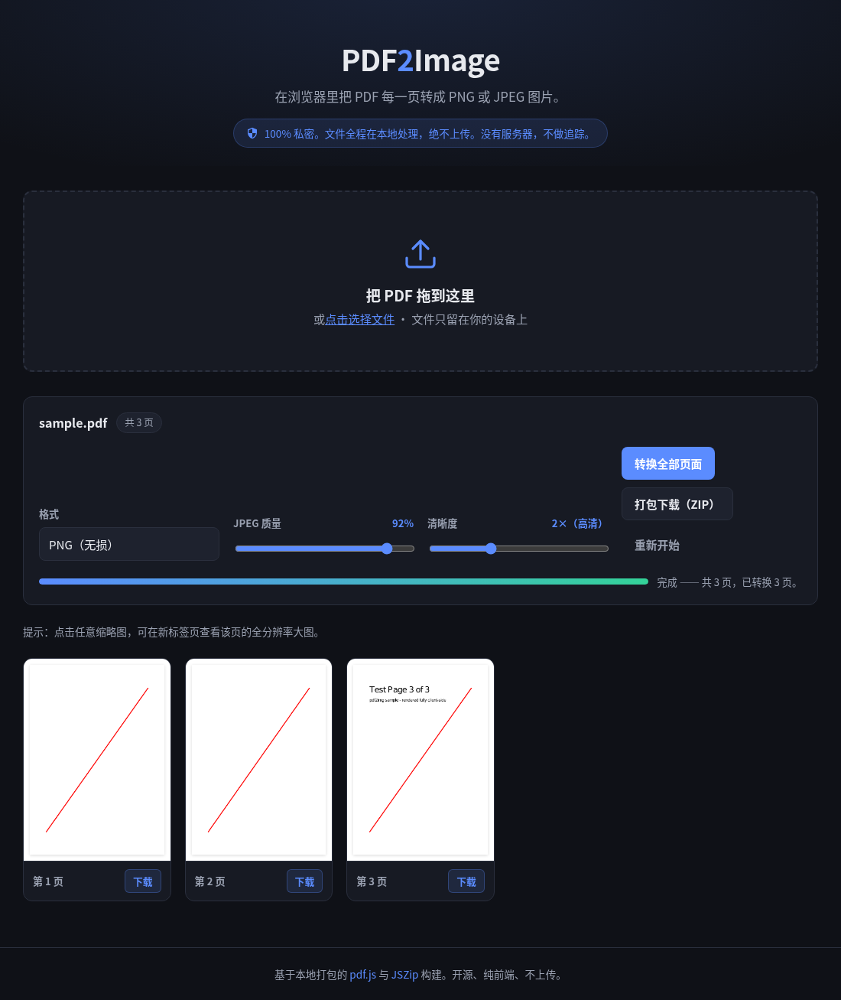

# PDF2Image

[English](#english) · [中文](#中文)




---

## English

Convert PDF pages into PNG or JPEG images — entirely in your browser.

**100% client-side.** Your files are read locally via the browser's `FileReader` and rendered with [pdf.js](https://mozilla.github.io/pdf.js/). Nothing is ever uploaded — no server, no analytics, no external calls. The page works offline once loaded.

🔗 Live demo: <https://ru.102345.xyz/pdf2img/>

### Features

- Drag-and-drop or click to select a PDF (with validation).
- Renders every page to a canvas with a live thumbnail grid.
- Choose output format: **PNG** (lossless) or **JPEG** (with quality slider).
- Resolution / scale control (1×–4×, defaults to **2× for sharp output**) for higher-DPI images.
- **Click any thumbnail to open the full-resolution image in a new tab** — no download needed.
- Per-page **Download** button.
- **Download all as ZIP** — produces `<pdfname>-pages.zip` with zero-padded `page-001.png` … entries ([JSZip](https://stuk.github.io/jszip/)).
- Incremental rendering with a progress bar; the UI stays responsive on large PDFs.
- Graceful handling of corrupt and password-protected files.
- Responsive, dark-themed design for mobile and desktop.

### Usage

It's a static site — no build step. Either:

- Open `index.html` directly in a browser, **or**
- Serve the folder with any static host (`python3 -m http.server`, nginx, etc.) and visit it.

Then drop a PDF in, pick your format/resolution, and click **Convert pages**.

### Privacy

Files are processed locally in your browser and never leave your device. The only network activity is loading the page's own vendored JavaScript libraries (bundled in `vendor/`).

### Project layout

```
index.html          Markup + UI (Chinese)
style.css           Styling (dark, responsive)
app.js              All conversion logic (vanilla JS, no framework)
vendor/             Pinned, locally-bundled libraries:
                      pdf.min.js + pdf.worker.min.js  (pdf.js 3.11.174)
                      jszip.min.js                    (JSZip 3.10.1)
test/               Sample-PDF generator + headless verification script
docs/screenshots/   UI screenshots used in this README
```

### Development / verification

```bash
node --check app.js              # syntax
node test/make-sample-pdf.js     # writes test/sample.pdf
node test/verify.js              # headless-browser end-to-end checks (18 assertions)
```

`test/verify.js` uses Puppeteer and points at a Chromium binary via `CHROME_BIN`. See [test/verify.js](test/verify.js).

### License

MIT. Bundled libraries retain their own licenses (pdf.js — Apache-2.0; JSZip — MIT/GPLv3).

---

## 中文

在浏览器里把 PDF 的每一页转换成 PNG 或 JPEG 图片。

**100% 本地处理。** 文件通过浏览器的 `FileReader` 在本地读取,用 [pdf.js](https://mozilla.github.io/pdf.js/) 渲染。全程不上传——没有服务器、不做统计、无任何外部请求。页面加载后即可离线使用。

🔗 在线体验:<https://ru.102345.xyz/pdf2img/>

### 功能特性

- 拖拽或点击选择 PDF(带格式校验)。
- 把每一页渲染到 canvas,实时生成缩略图网格。
- 可选输出格式:**PNG**(无损)或 **JPEG**(带质量滑块)。
- 分辨率 / 缩放档位(1×–4×,**默认 2× 保证清晰**),可输出更高 DPI 的图片。
- **点击任意缩略图,即可在新标签页打开该页全分辨率大图**——无需先下载。
- 每页独立 **下载** 按钮。
- **打包下载 ZIP**——生成 `<文件名>-pages.zip`,内含按页补零命名的 `page-001.png` … 条目([JSZip](https://stuk.github.io/jszip/))。
- 逐页增量渲染并显示进度条;处理大文件时界面依然流畅。
- 对损坏文件和加密(带密码)PDF 有友好提示,不崩溃。
- 深色主题,移动端与桌面端自适应。

### 使用方法

这是一个纯静态站点,无需构建。两种方式任选其一:

- 直接用浏览器打开 `index.html`,**或**
- 用任意静态服务器(`python3 -m http.server`、nginx 等)托管该目录后访问。

然后拖入一个 PDF,选择格式 / 分辨率,点击 **转换全部页面** 即可。

### 隐私说明

所有文件都在你的浏览器里本地处理,绝不离开你的设备。唯一的网络活动是加载页面自带的 JavaScript 库(已打包在 `vendor/` 目录中)。

### 目录结构

```
index.html          页面结构 + 界面(中文)
style.css           样式(深色、自适应)
app.js              全部转换逻辑(原生 JS,无框架)
vendor/             固定版本、本地打包的库:
                      pdf.min.js + pdf.worker.min.js  (pdf.js 3.11.174)
                      jszip.min.js                    (JSZip 3.10.1)
test/               示例 PDF 生成器 + 无头浏览器验证脚本
docs/screenshots/   本 README 使用的界面截图
```

### 开发 / 验证

```bash
node --check app.js              # 语法检查
node test/make-sample-pdf.js     # 生成 test/sample.pdf
node test/verify.js              # 无头浏览器端到端检查(18 项断言)
```

`test/verify.js` 使用 Puppeteer,通过 `CHROME_BIN` 指定 Chromium 可执行文件。详见 [test/verify.js](test/verify.js)。

### 许可证

MIT。打包的第三方库各自保留其许可证(pdf.js — Apache-2.0;JSZip — MIT/GPLv3)。
